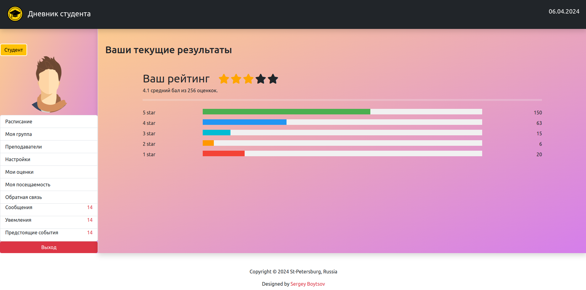

# Дневник студента на Django

### Инструменты
> - Python
> - Django
> - JavaScript
> - Bootstrap
> - HTMX
> - Docker
> - Celery
> - Redis
> - Postgres

### Задачи / функционал

Общие

<ol>
<li> Асинхронная отправка писем</li>
<li> Работа с Docker Redis Celery</li>
<li> Добавление JavaScript</li>
</ol>

Администратор

<ol>
<li> Добавлять новых пользователей</li>
<li> Добавлять новые группы студентов и предметы</li>
<li> Назначать сессии</li>
<li> Оценивать преподавателей</li>
<li> Переписка с персоналом</li>
<li> Отвечать на обратную связь пользователей</li>
</ol>

Студенты

<ol>
<li> Список всех оценок</li>
<li> Общий рейтинг студента</li>
<li> Переписка со своими одногруппниками и преподавателями</li>
<li> Обратная связь</li>
<li> Уведомления</li>
<li> Предстоящие события</li>
</ol>

Преподаватели

<ol>
<li> Вести отчет о посещаемости</li>
<li> Выставлять оценки</li>
<li> Личный рейтинг</li>
<li> Переписка с учениками и персоналом</li>
<li> Обратная связь</li>
<li> Уведомления</li>
</ol>

